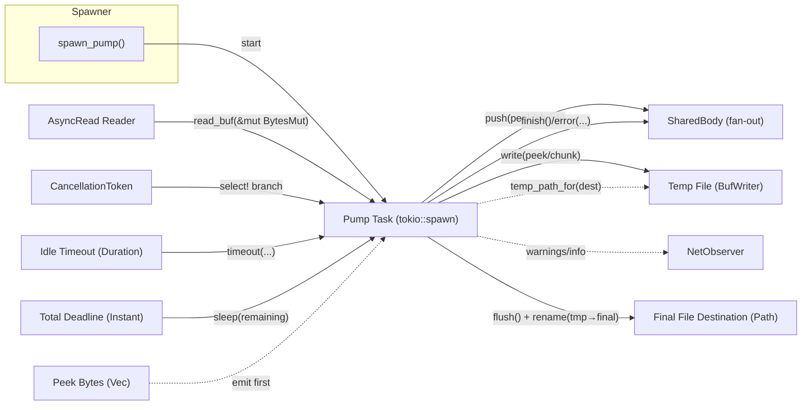

# Pump




# Sequence diagram

```svg
<svg xmlns="http://www.w3.org/2000/svg" width="1400" height="780" viewBox="0 0 1400 780">
  <defs>
    <marker id="arrow" markerWidth="10" markerHeight="10" refX="10" refY="5" orient="auto-start-reverse">
      <path d="M 0 0 L 10 5 L 0 10 z" fill="#111"/>
    </marker>
    <style>
      .lane { fill:#f8fafc; stroke:#1f2937; rx:8; ry:8; }
      .actor { fill:#eef2ff; stroke:#6366f1; rx:8; ry:8; }
      .label { font-family: system-ui, -apple-system, Segoe UI, Roboto, Ubuntu, Cantarell, Arial, 'Noto Sans', sans-serif; font-size:14px; fill:#111827;}
      .small { font-size:12px; fill:#334155; }
      .lifeline { stroke:#0f172a; stroke-dasharray:6 6; }
      .msg { stroke:#111827; stroke-width:1.6; fill:none; marker-end:url(#arrow); }
      .note { fill:#ecfeff; stroke:#06b6d4; rx:8; ry:8; }
    </style>
  </defs>

<text x="700" y="30" text-anchor="middle" style="font-weight:700; font-size:16px; font-family: system-ui;">Pump Runtime Sequence</text>

  <!-- Lanes / participants -->
  <!-- x positions -->
  <!-- S=80, PT=260, R=440, SB=620, TF=800, DST=980, OBS=1160, CN=1340 -->
  <!-- headers -->
<rect class="actor" x="40" y="50" width="120" height="36"/><text class="label" x="100" y="74" text-anchor="middle">spawn_pump()</text>
<rect class="actor" x="220" y="50" width="120" height="36"/><text class="label" x="280" y="74" text-anchor="middle">Pump Task</text>
<rect class="actor" x="400" y="50" width="120" height="36"/><text class="label" x="460" y="74" text-anchor="middle">Reader</text>
<rect class="actor" x="580" y="50" width="120" height="36"/><text class="label" x="640" y="74" text-anchor="middle">SharedBody</text>
<rect class="actor" x="760" y="50" width="120" height="36"/><text class="label" x="820" y="74" text-anchor="middle">Temp File</text>
<rect class="actor" x="940" y="50" width="120" height="36"/><text class="label" x="1000" y="74" text-anchor="middle">Final File</text>
<rect class="actor" x="1120" y="50" width="120" height="36"/><text class="label" x="1180" y="74" text-anchor="middle">Observer</text>
<rect class="actor" x="1300" y="50" width="120" height="36"/><text class="label" x="1360" y="74" text-anchor="middle">Cancel</text>

  <!-- lifelines -->
  <line class="lifeline" x1="100" y1="86" x2="100" y2="740"/>
  <line class="lifeline" x1="280" y1="86" x2="280" y2="740"/>
  <line class="lifeline" x1="460" y1="86" x2="460" y2="740"/>
  <line class="lifeline" x1="640" y1="86" x2="640" y2="740"/>
  <line class="lifeline" x1="820" y1="86" x2="820" y2="740"/>
  <line class="lifeline" x1="1000" y1="86" x2="1000" y2="740"/>
  <line class="lifeline" x1="1180" y1="86" x2="1180" y2="740"/>
  <line class="lifeline" x1="1360" y1="86" x2="1360" y2="740"/>

  <!-- messages -->
<path class="msg" d="M 100 120 L 280 120"/><text class="small" x="190" y="112" text-anchor="middle">spawn with cfg & targets</text>

<path class="msg" d="M 280 160 L 820 160"/><text class="small" x="550" y="152" text-anchor="middle">open temp_path_for(dest)</text>
<path class="msg" d="M 280 190 L 820 190"/><text class="small" x="550" y="182" text-anchor="middle">write(peek)</text>
<path class="msg" d="M 280 220 L 640 220"/><text class="small" x="460" y="212" text-anchor="middle">push(peek)</text>

  <!-- loop reads -->
<rect class="note" x="240" y="250" width="240" height="28"/><text class="small" x="360" y="268" text-anchor="middle">loop until EOF / timeout / cancel / error</text>

<path class="msg" d="M 280 300 L 460 300"/><text class="small" x="370" y="292" text-anchor="middle">timeout(idle, read_buf)</text>
<path class="msg" d="M 460 330 L 280 330"/><text class="small" x="370" y="322" text-anchor="middle">bytes read</text>
<path class="msg" d="M 280 360 L 640 360"/><text class="small" x="460" y="352" text-anchor="middle">push(chunk)</text>
<path class="msg" d="M 280 390 L 820 390"/><text class="small" x="550" y="382" text-anchor="middle">write(chunk)</text>

  <!-- EOF branch -->
<rect class="note" x="240" y="430" width="220" height="24"/><text class="small" x="350" y="446" text-anchor="middle">EOF (read == 0)</text>
<path class="msg" d="M 280 470 L 640 470"/><text class="small" x="460" y="462" text-anchor="middle">finish()</text>
<path class="msg" d="M 280 500 L 820 500"/><text class="small" x="550" y="492" text-anchor="middle">flush()</text>
<path class="msg" d="M 280 530 L 1000 530"/><text class="small" x="640" y="522" text-anchor="middle">rename(tmp → dest)</text>

  <!-- Timeout/cancel branch -->
<rect class="note" x="240" y="570" width="260" height="24"/><text class="small" x="370" y="586" text-anchor="middle">idle / total timeout</text>
<path class="msg" d="M 1360 570 L 280 570"/><text class="small" x="920" y="562" text-anchor="middle">cancelled()</text>
<path class="msg" d="M 280 610 L 640 610"/><text class="small" x="460" y="602" text-anchor="middle">error(Timeout/Cancelled)</text>

  <!-- Observer warnings -->
<path class="msg" d="M 280 650 L 1180 650"/><text class="small" x="730" y="642" text-anchor="middle">NetEvent::Warning (non-fatal file issues)</text>
</svg>
```